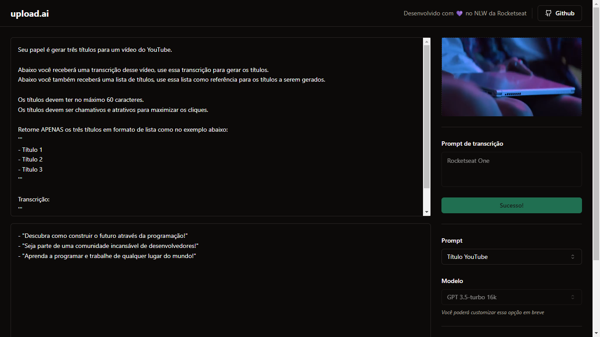

<h1 align="center" style="text-align: center;">
  upload.ai
</h1>

<p align="center">
  <a href="#project">Projeto</a>&nbsp;&nbsp;&nbsp;|&nbsp;&nbsp;&nbsp;
  <a href="#technologies">Tecnologias</a>&nbsp;&nbsp;&nbsp;|&nbsp;&nbsp;&nbsp;
  <a href="#usage">Utilização</a>&nbsp;&nbsp;&nbsp;|&nbsp;&nbsp;&nbsp;
  <a href="#license">Licença</a>
</p>

<p align="center">
  
</p>

<h2 id="project">📁 Projeto</h2>

O projeto consiste num gerador de descrições e títulos para vídeos do YouTube a partir da transcrição do conteúdo.

O front-end do projeto está disponível neste repositório.



<h2 id="technologies">💻 Tecnologias</h2>

Este projeto foi desenvolvido utilizando tecnologias como:

- React
- TypeScript
- Tailwind CSS
- Vite
- Radix UI
- PostCSS

<h2 id="usage">💡 Utilização</h2>

Para executar a aplicação em sua máquina localmente, certifique-se de ter o `Node.js` e o `npm` instalados antes de prosseguir com as etapas abaixo:

1. Clone o projeto:

```
$ git clone https://github.com/madalena-rocha/upload-ai-web
```

2. Acesse a pasta do projeto:

```
$ cd upload-ai-web
```

3. Instale as dependências:

```
$ npm install
```

4. Inicie o servidor:

```
$ npm run dev
```

---

Feito com 💙 by Bruno Beltrame
